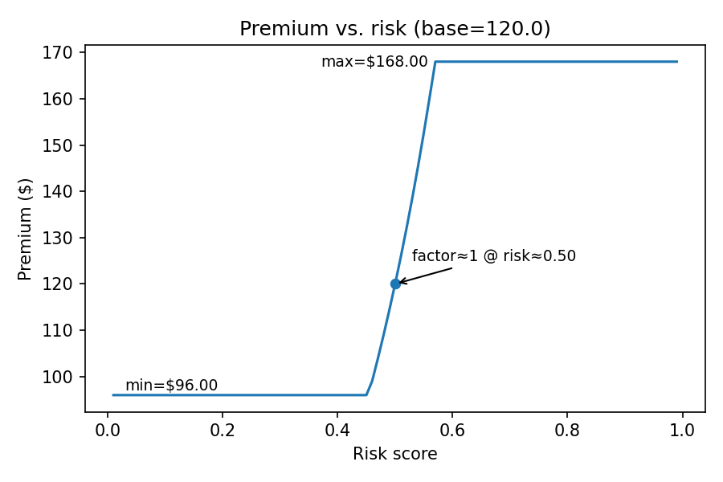

# Telematics Integration in Auto Insurance — POC (Josna John)

> **Final-Round Deliverable**
> End-to-end pipeline: **simulator → validation → features → GBM risk (monotone) → GLM-style pricing (caps/floors, pivot, slope) → API (FastAPI) → explainability (SHAP) → dashboard (Streamlit).**

## Highlights (what’s innovative)

* **Two-stage, regulator-friendly design:** ML risk score (CatBoost GBM with **monotonic constraints**) feeds a **GLM-style pricing** mapping (caps/floors + elasticity).
* **Explainability-first:** Global SHAP summary + per-trip contributors; top contributors returned in API.
* **Gamification:** badges for safe behavior (Smooth Operator, Speed Limit Hero, Gentle Handling, Daylight Driver).
* **Real-time feel:** `/score/stream` endpoint for rolling scoring as data arrives.
* **Demo-ready:** FastAPI Swagger, Streamlit UI, small anonymized samples only.
* **Cloud-ready (no local Docker required):** Render deploy for API, Streamlit Cloud for UI (configs included).

---

## Repository structure

```bash
/src
/data            # loaders & validation
/features        # feature engineering + featurize_trip
/models          # training, explainability, pricing, constraints
/api             # FastAPI service (app.py) + security
/gamification    # badges rules
/bin               # CLIs (simulate, dataset, price, mid-risk makers)
/models            # saved model + feature order (generated)
/data              # tiny samples & derived outputs (gitignored except small samples)
/docs              # explainability & pricing plots, privacy note

```

---

## Quickstart (Windows PowerShell)

### 0. Environment

```bash

python -m venv .venv
.\.venv\Scripts\Activate.ps1
pip install -r requirements.txt

```

### 1. Generate training data (simulated) & train GBM

```bash

python .\bin\generate_dataset.py --trips-per-mode 20 --duration 60 --hz 10 --out .\data\training\features.csv
python -m src.models.train_gbm --data .\data\training\features.csv --model-out .\models\gbm_risk.cbm --featnames-out .\models\gbm_risk_features.json

```

### 2. Explainability artifacts

```bash

python -m src.models.explain --train-data .\data\training\features.csv ^
  --model .\models\gbm_risk.cbm --featnames .\models\gbm_risk_features.json ^
  --trip .\data\samples\trip_eval.jsonl --outdir .\docs\explain

```
#### SHAP (global)


#### SHAP (this trip)


### 3. API (FastAPI) — local run

```bash

# optional security: set an API key
$env:API_KEY="change-me"
uvicorn src.api.app:app --reload
# Swagger at http://127.0.0.1:8000/docs
# All requests must include header: X-API-Key: change-me  (if API_KEY is set)

```

## One-line test:
```bash

$lines = Get-Content .\data\samples\trip_eval.jsonl -TotalCount 120 | % { $_ | ConvertFrom-Json }
$body  = $lines | ConvertTo-Json -Depth 6
Invoke-RestMethod -Uri "http://127.0.0.1:8000/score/trip" -Method POST -ContentType "application/json" -Headers @{ "X-API-Key" = "change-me" } -Body $body

```

### 4. Dashboard (Streamlit)

```bash

streamlit run .\streamlit_app.py
# Upload a JSONL file from data/samples/, see Risk, Premium, Badges, Contributors.

```

### 5. Pricing CLI (one-off)

```bash

python .\bin\price_trip.py --trip .\data\samples\trip_eval.jsonl --base-premium 120

```

---

## Real-time demo (streaming)

**Start API:**

```bash

$env:API_KEY="change-me"
uvicorn src.api.app:app --reload

```

**Simulate a 1-minute aggressive trip and send in chunks:**

```bash

python .\bin\simulate_stream.py --mode aggressive --duration 60 --hz 10 --out .\data\samples\trip_stream.jsonl --trip-id stream01

$lines   = Get-Content .\data\samples\trip_stream.jsonl
$session = $null
for ($i=0; $i -lt 5; $i++) {
  $chunk = $lines[($i*20)..([math]::Min(($i+1)*20-1, $lines.Count-1))] | % { $_ | ConvertFrom-Json }
  $body  = @{ session_id = $session; records = $chunk } | ConvertTo-Json -Depth 6
  $resp  = Invoke-RestMethod -Uri "http://127.0.0.1:8000/score/stream" `
            -Method POST -ContentType "application/json" -Headers @{ "X-API-Key"="change-me" } -Body $body
  if (-not $session) { $session = $resp.session_id }
  Write-Host ("Chunk {0}: n={1}, risk={2:N3}" -f ($i+1), $resp.n_records, $resp.risk_score)
}

```

---

## “Mid-risk” generator (ideal for slope/pivot demos)

**Binary-search blend (targets ~0.50):**

```bash

python .\bin\make_midrisk_blend.py --target 0.50 --tol 0.02 --duration 60 --hz 10 --out .\data\samples\trip_mid_blend.jsonl

```

Upload `trip_mid_blend.jsonl` in Streamlit. Set **floor=0.80, cap=1.40, slope=1.2, pivot≈0.50** to see pricing react (not clamped).

---

## Pricing sensitivity plots (docs)

```bash

python -m src.models.price_curve --base-premium 120 --floor 0.75 --cap 1.5 --slope 1.75 --outdir .\docs\pricing

```
# Artifacts:

### Pricing curves




```html

<p align="center">
  
  &nbsp;&nbsp;
  
</p>

```

*Figure: GLM-style mapping; guardrails (floor/cap) indicated with dashed lines.*


### How the pricing stub works (plain English)

We start from a **base premium** (e.g., $120). The model outputs a **risk_score** in [0,1]. We turn that into a **premium_factor** using a GLM-style curve:

**premium_factor = exp(intercept + slope × logit(risk_score))**, then we **clamp** it between **floor** and **cap**.

* **base_premium**: starting price before behavior (e.g., $120).
* **floor**: biggest **discount** allowed (e.g., 0.80 → at most 20% off).
* **cap**: biggest **surcharge** allowed (e.g., 1.40 → at most 40% extra).
* **slope**: how **sensitive** price is to risk (steeper around the midpoint).
* **intercept**: shifts the curve left/right. With intercept=0, factor≈1.0 at risk≈0.5.
  Negative → cheaper at same risk; Positive → pricier.
* **pivot (UI)**: convenience control; the app computes `intercept = − slope × logit(pivot)` so factor≈1 at the chosen pivot.
* **territory_mult / vehicle_mult**: placeholders for traditional rating factors.

Finally, **premium = base_premium × premium_factor**. Guardrails (floor/cap) keep prices stable and filing-friendly.

---

## Model quality (evaluation artifacts)

### Run
``` bash

python -m src.models.evaluate --data .\data\training\features.csv --outdir .\docs\metrics

```

#### Artifacts:

 — residuals vs prediction
 — predicted risk histogram
 — regression reliability curve
 — CatBoost gain importances

A CSV with metric values is saved to `docs/metrics/model_comparison.csv` (CatBoost-only).


### Why CatBoost for UBI risk & pricing

* **Monotone by design:** Easy, explicit **monotonic constraints** ensure core safety signals (hard braking, speeding exposure, jerk, cornering) can’t accidentally *lower* risk. That’s regulator-friendly and avoids pricing cliffs.
* **Smoother partial effects:** CatBoost’s **symmetric (oblivious) trees** produce globally consistent, smooth responses—less edge-case flipping, more stable premiums across the range.
* **Leakage-resistant training:** **Ordered boosting** reduces target leakage and variance on small/medium tabular data, yielding **more stable refits** with minimal hyper-tuning—key for premium stability over time.
* **Explainability that survives retrains:** With monotone constraints + ordered boosting, **SHAP reason codes** tend to stay directionally consistent across retrains, making customer explanations and internal reviews simpler.
* **Operationally simple:** Ships as a single **`.cbm`** artifact, fast CPU inference, clean `load_model()` API, and native support for **TreeExplainer/SHAP**—great for services and dashboards.
* **Strong accuracy without fragility:** Competitive with other GBDT libraries on tabular problems while being less sensitive to parameter twiddling—ideal for a production pricing pipeline that must be **accurate *and* dependable**.
* **Pricing-ready outputs:** The stable, monotone risk score plugs neatly into the **GLM-style pricing** curve (caps/floors, slope, pivot), giving you defendable, elastic premiums with clear guardrails.


---

## Cloud-ready deployment (no local Docker)

### FastAPI on **Render**

Files included:

* `Procfile`

  ```bash

  web: uvicorn src.api.app:app --host 0.0.0.0 --port $PORT

  ```
* `render.yaml`

  ```yaml

  services:
    - type: web
      name: insurity-ubi-api
      env: python
      plan: free
      buildCommand: "pip install -r requirements.txt"
      startCommand: "uvicorn src.api.app:app --host 0.0.0.0 --port $PORT"
      envVars:
        - key: PYTHONPATH
          value: .
        - key: API_KEY
          sync: false   # set in Render dashboard

  ```

**Deploy:** Push to GitHub → Render “New → Web Service → from repo” → set `API_KEY` → Create.
**Call:** Add header `X-API-Key: change-me`.

### Streamlit on **Streamlit Community Cloud**

Connect repo → pick `streamlit_app.py` → deploy.
(Optionally call the hosted API, or use the local model files as in this repo.)

---

## Security & Privacy (POC)

* **Security:** API can be protected by **`X-API-Key`** header (`API_KEY` env var). HTTPS is handled by the hosting platform.
* **Privacy:** This repo uses **simulated** data only. For production: collect consented telemetry, separate identifiers from events, encrypt in transit & at rest, role-based access, short raw-data retention with aggregation.

---

## Screens (videos)

1. Swagger `/docs` showing 200 from `/score/trip`.


```html
<!-- Swagger scoring success -->
<video src="docs/screens/swagger_score_trip.mp4" controls muted loop playsinline width="800">
  Your browser does not support the video tag.
</video>
```

2. Streamlit **Risk / Premium / Badges** header + **Top contributors** chart.

```html
<!-- Streamlit demo -->
<video src="docs/screens/streamlit_demo.mp4" controls muted loop playsinline width="800">
  Your browser does not support the video tag.
</video>
```

---

## Useful one-liners

**Smooth/Normal/Aggressive samples**

```bash

python .\bin\simulate_stream.py --mode smooth     --duration 60 --hz 10 --out .\data\samples\trip_smooth.jsonl --trip-id smooth01
python .\bin\simulate_stream.py --mode normal     --duration 60 --hz 10 --out .\data\samples\trip_normal.jsonl --trip-id normal01
python .\bin\simulate_stream.py --mode aggressive --duration 60 --hz 10 --out .\data\samples\trip_risky.jsonl  --trip-id risky01

```

**Mid-risk blend (for pricing demos)**

```bash

python .\bin\make_midrisk_blend.py --target 0.50 --tol 0.02 --out .\data\samples\trip_mid_blend.jsonl

```

---

## License

MIT (see `LICENSE`)

---

**Contact:** Josna John — thanks for reviewing!
