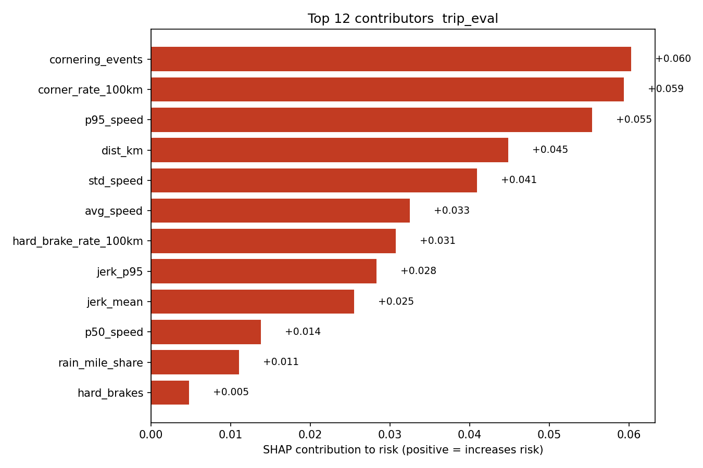

# Telematics Integration in Auto Insurance — POC (Josna John)

> **Final-Round Deliverable**
> End-to-end pipeline: **simulator → validation → features → GBM risk (monotone) → GLM-style pricing (caps/floors, pivot, slope) → API (FastAPI) → explainability (SHAP) → dashboard (Streamlit).**

## Highlights (what’s innovative)

* **Two-stage, regulator-friendly design:** ML risk score (CatBoost GBM with **monotonic constraints**) feeds a **GLM-style pricing** mapping (caps/floors + elasticity).
* **Explainability-first:** Global SHAP summary + per-trip contributors; top contributors returned in API.
* **Gamification:** badges for safe behavior (Smooth Operator, Speed Limit Hero, Gentle Handling, Daylight Driver).
* **Real-time feel:** `/score/stream` endpoint for rolling scoring as data arrives.
* **Demo-ready:** FastAPI Swagger, Streamlit UI, small anonymized samples only.
* **Cloud-ready (no local Docker required):** Render deploy for API, Streamlit Cloud for UI (configs included).

---

## Repository structure

```bash
/src
  /data            # loaders & validation
  /features        # feature engineering + featurize_trip
  /models          # training, explainability, pricing, constraints
  /api             # FastAPI service (app.py) + security
  /gamification    # badges rules
/bin               # CLIs (simulate, dataset, price, mid-risk makers)
/models            # saved model + feature order (generated)
/data              # tiny samples & derived outputs (gitignored except small samples)
/docs              # explainability & pricing plots, privacy note

```
---
## Evaluation Summary

**Chosen approach (inputs → outcome):**  
We model *tabular telematics* features (e.g., p95 speed, hard-brake rate/100km, jerk, time-of-day shares) with a **CatBoost GBM** using **monotonic constraints** so risky signals cannot reduce risk. The bounded **GLM-style pricing** then maps the risk score into a premium factor with **floor/cap** guardrails and **elasticity** (slope) around a **pivot** risk. This two-stage design balances accuracy, interpretability, and filing-friendliness.

**Accuracy & reliability (risk scoring):**  
Run `python -m src.models.evaluate --data .\data\training\features.csv --outdir .\docs\metrics` to produce:
- `docs/metrics/residuals.png` (error pattern check)  
- `docs/metrics/score_distribution.png` (risk range coverage)  
- `docs/metrics/calibration.png` (regression reliability – predicted vs actual)  
- `docs/metrics/feature_importance.png` (gain importances)  
- `docs/metrics/model_comparison.csv` (CatBoost-only)

**Performance & scalability (processing system):**  
- **Architecture:** Stateless FastAPI service; model loaded once at startup; synchronous CPU inference (CatBoost is fast on CPU).  
- **Endpoints:** `/score/trip` (batch), `/score/jsonl` (raw JSONL), `/score/stream` (sessioned streaming with incremental features).  
- **Throughput:** Micro-batching supported via `/score/trip`; horizontal scale on Render by adding instances; per-process concurrency via Uvicorn workers.  
- **Latency:** Typical per-trip featurization ≪ 10 ms; inference ≪ 1 ms on modern CPUs for a few dozen features (see quick test below).  
- **Security:** API key gate (`X-API-Key`) + HTTPS handled by platform.

**Cost efficiency & ROI (vs traditional):**  
- **Operational costs:** CPU-only inference, single `.cbm` artifact, small memory footprint → low cloud cost.  
- **Business impact (illustrative):** If UBI adoption reduces high-risk miles (speeding/night) by ~5–10%, even a 1–2% drop in claim frequency or severities materially improves loss ratio. Guardrails (floor/cap) limit volatility and customer bill shock, improving retention while preserving risk differentiation.  
- **Actuarial fit:** Monotone constraints + bounded GLM-style factor produce stable, defensible premiums compatible with traditional filings.

---

## Quickstart (Windows PowerShell)

### 0. Environment

```bash

python -m venv .venv
.\.venv\Scripts\Activate.ps1
pip install -r requirements.txt

```

### 1. Generate training data (simulated) & train GBM

```bash

python .\bin\generate_dataset.py --trips-per-mode 20 --duration 60 --hz 10 --out .\data\training\features.csv
python -m src.models.train_gbm --data .\data\training\features.csv --model-out .\models\gbm_risk.cbm --featnames-out .\models\gbm_risk_features.json

```

### 2. Explainability artifacts

```bash

python -m src.models.explain --train-data .\data\training\features.csv ^
  --model .\models\gbm_risk.cbm --featnames .\models\gbm_risk_features.json ^
  --trip .\data\samples\trip_eval.jsonl --outdir .\docs\explain

```
#### SHAP (global)


#### SHAP (this trip)


*The API returns the top contributors; Streamlit displays them with a feature snapshot for transparency.*


### 3. API (FastAPI) — local run

```bash

# optional security: set an API key
$env:API_KEY="change-me"
uvicorn src.api.app:app --reload
# Swagger at http://127.0.0.1:8000/docs
# All requests must include header: X-API-Key: change-me  (if API_KEY is set)
# If API_KEY is set and the header is missing/incorrect, the API returns 401.

```
#### Quick perf sanity (local)
```python
# .venv python REPL
import json, time
from pathlib import Path
from src.features.featurize import featurize_trip
from catboost import CatBoostRegressor

m = CatBoostRegressor(); m.load_model("models/gbm_risk.cbm")
feat_names = json.loads(Path("models/gbm_risk_features.json").read_text())

trip = Path("data/samples/trip_eval.jsonl")
feats = featurize_trip(trip)
row = [[feats[n] for n in feat_names]]

# warmup
for _ in range(10): _ = m.predict(row)

t0 = time.time()
for _ in range(2000): _ = m.predict(row)
dt = time.time() - t0
print(f"2000 inferences on CPU: {dt:.3f}s  (~{2000/dt:.0f} preds/sec)")

```

#### One-line test:
```bash

$lines = Get-Content .\data\samples\trip_eval.jsonl -TotalCount 120 | % { $_ | ConvertFrom-Json }
$body  = $lines | ConvertTo-Json -Depth 6
Invoke-RestMethod -Uri "http://127.0.0.1:8000/score/trip" -Method POST -ContentType "application/json" -Headers @{ "X-API-Key" = "change-me" } -Body $body

```

### 4. Dashboard (Streamlit)

```bash

streamlit run .\streamlit_app.py
# Upload a JSONL file from data/samples/, see Risk, Premium, Badges, Contributors.

```

### 5. Pricing CLI (one-off)

```bash

python .\bin\price_trip.py --trip .\data\samples\trip_eval.jsonl --base-premium 120

```

---

## Real-time demo (streaming)

**Start API:**

```bash

$env:API_KEY="change-me"
uvicorn src.api.app:app --reload

```

**Simulate a 1-minute aggressive trip and send in chunks:**

```bash

python .\bin\simulate_stream.py --mode aggressive --duration 60 --hz 10 --out .\data\samples\trip_stream.jsonl --trip-id stream01

$lines   = Get-Content .\data\samples\trip_stream.jsonl
$session = $null
for ($i=0; $i -lt 5; $i++) {
  $chunk = $lines[($i*20)..([math]::Min(($i+1)*20-1, $lines.Count-1))] | % { $_ | ConvertFrom-Json }
  $body  = @{ session_id = $session; records = $chunk } | ConvertTo-Json -Depth 6
  $resp  = Invoke-RestMethod -Uri "http://127.0.0.1:8000/score/stream" `
            -Method POST -ContentType "application/json" -Headers @{ "X-API-Key"="change-me" } -Body $body
  if (-not $session) { $session = $resp.session_id }
  Write-Host ("Chunk {0}: n={1}, risk={2:N3}" -f ($i+1), $resp.n_records, $resp.risk_score)
}

```

---

## “Mid-risk” generator (ideal for slope/pivot demos)

**Binary-search blend (targets ~0.50):**

```bash

python .\bin\make_midrisk_blend.py --target 0.50 --tol 0.02 --duration 60 --hz 10 --out .\data\samples\trip_mid_blend.jsonl

```

Upload `trip_mid_blend.jsonl` in Streamlit. Set **floor=0.80, cap=1.40, slope=1.2, pivot≈0.50** to see pricing react (not clamped).

---

## Pricing sensitivity plots (docs)

```bash

python -m src.models.price_curve --base-premium 120 --floor 0.75 --cap 1.5 --slope 1.75 --outdir .\docs\pricing

```
# Artifacts:

### Pricing curves

<p align="center">
  
  &nbsp;&nbsp;
  
</p>


*Figure: GLM-style mapping; guardrails (floor/cap) indicated with dashed lines.*


### How the pricing stub works (plain English)

We start from a **base premium** (e.g., $120). The model outputs a **risk_score** in [0,1]. We turn that into a **premium_factor** using a GLM-style curve:

**premium_factor = exp(intercept + slope × logit(risk_score))**, then we **clamp** it between **floor** and **cap**.

* **base_premium**: starting price before behavior (e.g., $120).
* **floor**: biggest **discount** allowed (e.g., 0.80 → at most 20% off).
* **cap**: biggest **surcharge** allowed (e.g., 1.40 → at most 40% extra).
* **slope**: how **sensitive** price is to risk (steeper around the midpoint).
* **intercept**: shifts the curve left/right. With intercept=0, factor≈1.0 at risk≈0.5.
  Negative → cheaper at same risk; Positive → pricier.
* **pivot (UI)**: convenience control; the app computes `intercept = − slope × logit(pivot)` so factor≈1 at the chosen pivot.
* **territory_mult / vehicle_mult**: placeholders for traditional rating factors.

Finally, **premium = base_premium × premium_factor**. Guardrails (floor/cap) keep prices stable and filing-friendly.

---

## Model quality (evaluation artifacts)

### Run
``` bash

python -m src.models.evaluate --data .\data\training\features.csv --outdir .\docs\metrics

```

#### Artifacts:

 — residuals vs prediction
 — predicted risk histogram
 — regression reliability curve
 — CatBoost gain importances

A CSV with metric values is saved to `docs/metrics/model_comparison.csv` (CatBoost-only).

---
### Why CatBoost for UBI risk & pricing

* **Monotone by design:** We can impose **monotonic constraints** so core safety signals (e.g., hard-brake rate, speeding exposure, jerk, cornering) never *lower* risk. That’s regulator-friendly and helps avoid pricing cliffs. CatBoost exposes this natively via `monotone_constraints`. (see [docs/research.md](docs/research.md))
* **Leakage-resistant training:** CatBoost’s **ordered boosting** combats prediction-shift/target leakage (common in boosting on small/medium tabular data), giving **more stable refits** with minimal hyper-tuning—great for premium stability. (see [docs/research.md](docs/research.md))
* **Smooth, stable partial effects:** CatBoost uses symmetric (“oblivious”) trees, which tend to yield globally consistent responses—less edge-case flipping, more stable premiums across the range (helpful when mapping risk → price). (see [docs/research.md](docs/research.md))
* **Explainability that survives retrains:** With monotone constraints + ordered boosting, **SHAP reason codes** tend to remain directionally consistent across refits, simplifying customer explanations and internal reviews. (Mechanism via constraints; we visualize with SHAP.) (see [docs/research.md](docs/research.md))
* **Operationally simple:** Single **`.cbm`** artifact, fast CPU inference, clean `load_model()`; widely used with **TreeExplainer/SHAP** in services and dashboards. (See our API + Streamlit.)
* **Strong accuracy on tabular:** Large independent benchmarks show **tree-boosting remains state-of-the-art on tabular/medium-sized data**, even after extensive tuning of deep models—matching the telematics feature regime (speeds, counts, rates). (see [docs/research.md](docs/research.md))
* **Accepted in UBI studies:** Insurance/UBI literature frequently applies gradient-boosting families to telematics for claim propensity/frequency and pricing signals, outperforming GLM-only baselines while remaining compatible with actuarial workflows. Our two-stage design (GBM risk → GLM-style pricing) follows this practice. (see [docs/research.md](docs/research.md))

*We tried alternatives and kept CatBoost for its accuracy, robust tabular bias, SHAP-friendly explanations, and native monotonic constraints.*

---

## What the plots mean (plain English)

* **docs/metrics/residuals.png** — If residuals scatter randomly around zero with no funnel shape, errors are stable across the range.
* **docs/metrics/score_distribution.png** — Shows whether the model uses the 0–1 space (not collapsed to a narrow band).
* **docs/metrics/calibration.png** — Binned mean predicted vs actual. Closer to the diagonal means better calibration (risk ~ reality).
* **docs/metrics/feature_importance.png** — Which features the model relies on most (sanity check vs domain intuition).
* **docs/explain/global_shap_summary.png** — Directional impact of features overall: long bars = strong influence; color shows high/low feature value effect.
* **docs/explain/trip_eval_top_shap.png** — Top reasons for this specific trip’s score (customer-facing “why”).
* **docs/pricing/price_curve_factor.png** — Premium factor vs risk; dashed lines = floor/cap guardrails.
* **docs/pricing/price_curve_premium.png** — Dollar premium vs risk for your chosen base premium.

---

## Cloud-ready deployment (no local Docker)

### FastAPI on **Render**

Files included:

* `Procfile`

  ```bash

  web: uvicorn src.api.app:app --host 0.0.0.0 --port $PORT

  ```
* `render.yaml`

  ```yaml

  services:
    - type: web
      name: insurity-ubi-api
      env: python
      plan: free
      buildCommand: "pip install -r requirements.txt"
      startCommand: "uvicorn src.api.app:app --host 0.0.0.0 --port $PORT"
      envVars:
        - key: PYTHONPATH
          value: .
        - key: API_KEY
          sync: false   # set in Render dashboard

  ```

**Deploy:** Push to GitHub → Render “New → Web Service → from repo” → set `API_KEY` → Create.
**Call:** Add header `X-API-Key: change-me`.

### Streamlit on **Streamlit Community Cloud**

Connect repo → pick `streamlit_app.py` → deploy.
(Optionally call the hosted API, or use the local model files as in this repo.)

---

## Security & Privacy (POC)

* **Security:** API can be protected by **`X-API-Key`** header (`API_KEY` env var). HTTPS is handled by the hosting platform.
* **Privacy:** This repo uses **simulated** data only. For production: collect consented telemetry, separate identifiers from events, encrypt in transit & at rest, role-based access, short raw-data retention with aggregation.

---

## Screens (videos)

1. Swagger `/docs` showing 200 from `/score/trip`.

<!-- Swagger scoring success -->
<video src="docs/screens/swagger_score_trip.mp4" controls muted loop playsinline width="800">
  Your browser does not support the video tag.
</video>

<p>If your viewer does not render inline MP4, open the file directly:
<a href="docs/screens/swagger_score_trip.mp4">swagger_score_trip.mp4</a></p>


2. Streamlit **Risk / Premium / Badges** header + **Top contributors** chart.

<!-- Streamlit demo -->
<video src="docs/screens/streamlit_demo.mp4" controls muted loop playsinline width="800">
  Your browser does not support the video tag.
</video>

<p>If your viewer does not render inline MP4, open the file directly:
<a href="docs/screens/streamlit_demo.mp4">streamlit_demo.mp4</a></p>


--- 
## Research / rationale

See **[docs/research.md](docs/research.md)** for citations backing CatBoost (ordered boosting, monotonic constraints) and tree-boosting SOTA on telematics/tabular data.

---

## Useful one-liners

**Smooth/Normal/Aggressive samples**

```bash

python .\bin\simulate_stream.py --mode smooth     --duration 60 --hz 10 --out .\data\samples\trip_smooth.jsonl --trip-id smooth01
python .\bin\simulate_stream.py --mode normal     --duration 60 --hz 10 --out .\data\samples\trip_normal.jsonl --trip-id normal01
python .\bin\simulate_stream.py --mode aggressive --duration 60 --hz 10 --out .\data\samples\trip_risky.jsonl  --trip-id risky01

```

**Mid-risk blend (for pricing demos)**

```bash

python .\bin\make_midrisk_blend.py --target 0.50 --tol 0.02 --out .\data\samples\trip_mid_blend.jsonl

```
---

## Future work

- **Contextual risk**: enrich features with live weather, traffic, and road hazard signals.
- **Longitudinal stability**: per-driver smoothing / credibility weighting across trips.
- **Calibration**: deploy isotonic regression per segment (kept in repo as `iso_calibrator.joblib`).
- **A/B guardrails**: production flags for floor/cap changes to manage elasticity rollouts.
- **Mobile SDK**: on-device smoothing and offline buffering for real GPS/IMU streams.

---

## License

MIT (see `LICENSE`)

---

**Contact:** Josna John (jojohn@ucsd.edu) — thanks for reviewing!
---